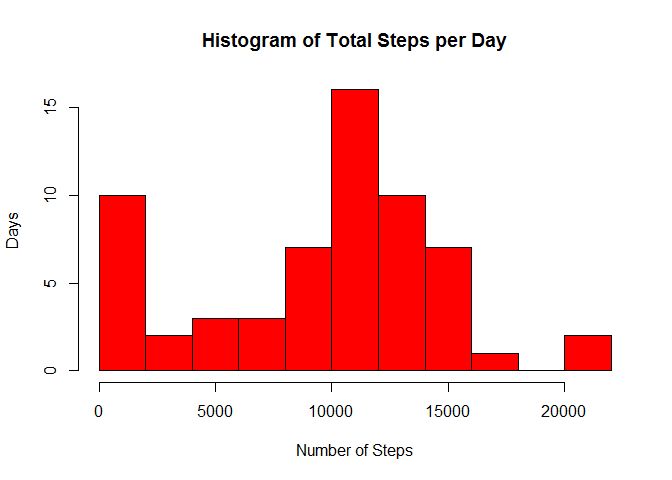
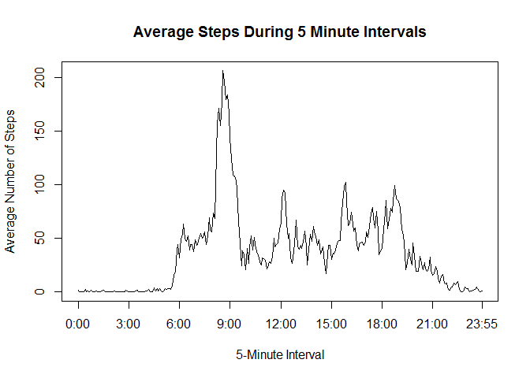
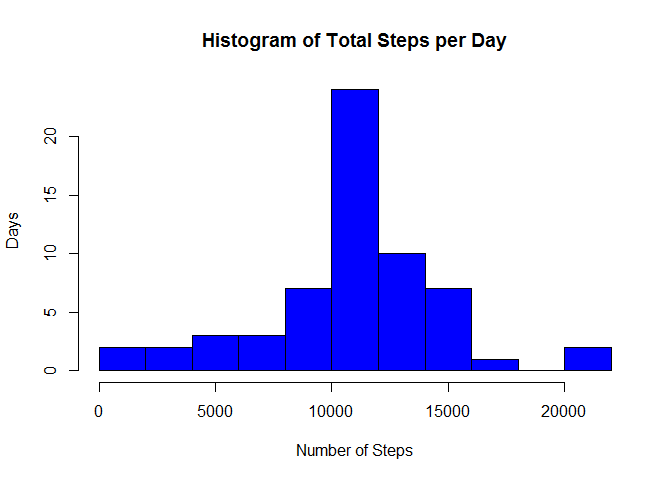

# Reproducible Research: Peer Assessment 1


## Loading and preprocessing the data

```r
activity <- read.csv("activity.csv", na.strings = "NA")
activity$date <- as.Date(activity$date)
days <- unique(activity$date)
```

## What is mean total number of steps taken per day?

```r
sums <- tapply(activity$steps, activity$date, sum, na.rm=TRUE)
```

Histogram of steps taken per day

```r
hist(sums, main="Histogram of Total Steps per Day", ylab="Days", xlab="Number of Steps", col="red", breaks=8)
```

 

Mean and median steps taken each day

```r
mean_sum <- round(mean(sums),1)
median_sum <- round(median(sums),1)
print(c(Mean = mean_sum))
```

```
##   Mean 
## 9354.2
```

```r
print(c(Median = median_sum))
```

```
## Median 
##  10395
```

## What is the average daily activity pattern?

```r
intervals <- unique(activity$interval)
intsteps <- aggregate(activity$steps ~ activity$interval, FUN = mean) 
colnames(intsteps) <- c("intervals","mean.steps")
```

Plot of average steps taken in 5 minute intervals

```r
plot(seq(0,287), intsteps$mean.steps, type = "l", xlab = "5-Minute Interval", ylab = "Average Number of Steps", main = "Average Steps During 5 Minute Intervals",xaxt="n")
axis(1,at=c(seq(0,254,by=36),287),labels=c("0:00","3:00","6:00","9:00","12:00","15:00","18:00","21:00","23:55"))
```

 

Which 5-min interval, on average across all the days, contains the maximum number of steps?

```r
maxstepinterval <- intsteps$interval[intsteps$mean.steps == max(intsteps$mean.steps)]
time <- maxstepinterval
maxsteps <- round(max(intsteps$mean.steps),1)
```
The 5-minute interval at 835am has a maximum average, with a mean of 206.2 steps.

## Imputing missing values
The total number of missing values (NA) is:

```r
dim(activity)[1]-sum(complete.cases(activity))
```

```
## [1] 2304
```

If it is assumed that there are only NA values in the steps data, then a simpler way to calculate this is

```r
sum(is.na(activity))
```

```
## [1] 2304
```

The NA step values will be replaced with the mean value for that 5 minute interval (averaged over all the days)

```r
activity_nona <- activity
activity_nona$intavg <- intsteps$mean.steps

activity_nona$steps[!complete.cases(activity_nona) == "TRUE"] <- activity_nona$intavg[!complete.cases(activity_nona) == "TRUE"]
```

Histogram of steps taken per day after replacing NA step values

```r
sums_nona <- tapply(activity_nona$steps, activity_nona$date, sum, na.rm=TRUE)
hist(sums_nona, main="Histogram of Total Steps per Day", ylab="Days", xlab="Number of Steps", col="blue", breaks=8)
```

 

Mean and median steps taken each day

```r
print(c(Mean = round(mean(sums_nona),1)))
```

```
##    Mean 
## 10766.2
```

```r
print(c(Median = round(median(sums_nona),1)))
```

```
##  Median 
## 10766.2
```

Before removing the NA values from the steps, the mean was 9354.2 and the median was 1.0395\times 10^{4}. Taking the NA values out and replacing them with the mean values for the 5-minute intervals made the means and medians the same. The medians before were biased by the number of NA values, while the mean just ignored them.

Adding values in for the NA values increased both the mean and median number of steps taken each day.

## Are there differences in activity patterns between weekdays and weekends?

Create a factor variable for the weekdays and weekends

```r
activity_nona$day <- as.factor(weekdays(activity_nona$date))
levels(activity_nona$day) <- list("weekday"="Monday", "weekday"="Tuesday", "weekday"="Wednesday", "weekday"="Thursday", "weekday"="Friday", "weekend"="Saturday", "weekend"="Sunday")
```

Find the mean steps for each 5-minute interval for weekend and weekday   days.

```r
dayintsteps <- aggregate(activity_nona$steps,list(activity_nona$interval, activity_nona$day), FUN = mean)
colnames(dayintsteps) <- c("intervals","day","steps")
```

Plot of average steps taken in 5 minute intervals on the weekend and weekday days

```r
library(lattice)
xyplot(dayintsteps$steps ~ dayintsteps$intervals | dayintsteps$day,data=dayintsteps,layout=c(1,2),type="l",xlab="Interval",ylab="Number of Steps")
```

 
